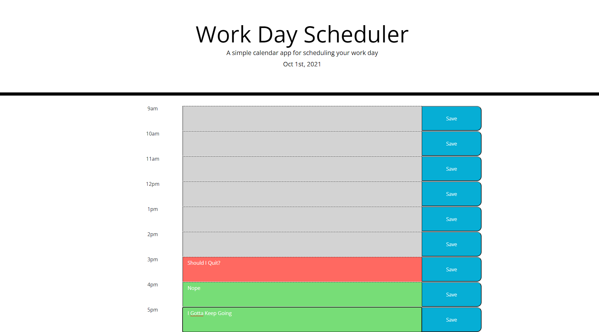

# Work Day Scheduler

## My Task

Create a simple calendar application that allows a user to save events for each hour of the day by modifying starter code. This app will run in the browser and feature dynamically updated HTML and CSS powered by jQuery.

## User Story

```
AS AN employee with a busy schedule
I WANT to add important events to a daily planner
SO THAT I can manage my time effectively
```

## Acceptance Criteria

```
1) When the planner is opened the current day is displayed in the header of the page

2) The user is presented with time blocks for the day 

3) The user is able to click into the timeblock and enter an event

4) The user can save the event by clicking the save button in the time block

5) The event is saved to local storage

6) The user is able to view the timeblocks as color coded indicating past, present, future

7) When the page is refreshed the events are saved to the calendar

8) The application uses Moment to display the current date


```
## Screenshot
The following screenshot demonstrates the functionality:




## Link to functioning site

https://chuck2076.github.io/Daily_Planner_CRS/ 


